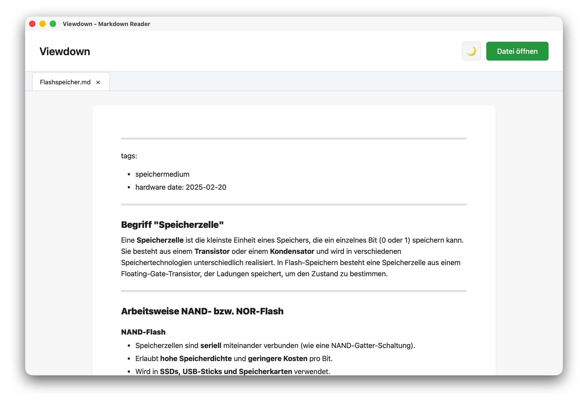
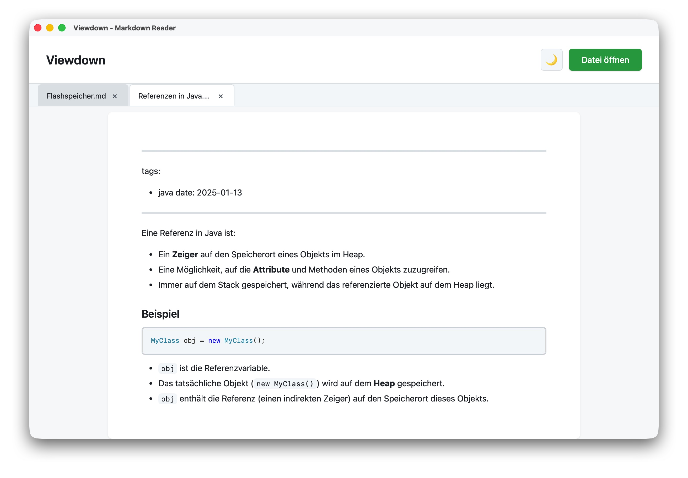

# Viewdown – Moderner Markdown Reader (Tauri + React)

Viewdown ist ein schneller, schlanker und plattformübergreifender Markdown‑Reader. Ziehe einfach eine Datei ins Fenster, öffne sie per Dialog – oder starte Viewdown direkt mit einer Datei über die CLI. Mit Tabs, Dunkel-/Hellmodus, GitHub‑Flavored Markdown (GFM) und Syntax‑Highlighting für Code.

## Features
- Drag & Drop: Markdown‑Dateien einfach ins Fenster ziehen
- Datei öffnen Dialog: Praktischer Button zum Öffnen lokaler Dateien
- Mehrere Tabs: Mehrere Dateien parallel ansehen und schnell wechseln
- Dark/Light Theme: Mit einem Klick zwischen hell und dunkel wechseln (persistiert)
- GitHub‑Flavored Markdown (GFM): Tabellen, Aufgabenlisten, Strikethrough u. v. m.
- Syntax‑Highlighting: Schöne Codeblöcke via Prism Themes (One Dark, VS)
- Desktop‑App mit Tauri: Schnell, leichtgewichtig, native Bundles
- CLI‑Integration: Datei direkt beim Start laden (s. Nutzung)

## Schnellstart (Entwicklung)
Voraussetzungen:
- Node.js (aktuell) und pnpm
- Rust Toolchain (für Tauri)
- Tauri CLI: `pnpm dlx tauri@latest -v` (oder global via Cargo)

Befehle:
- Entwicklung starten: `pnpm tauri dev` (oder zuerst `pnpm install`, dann `pnpm tauri dev`)
- Webbuild erstellen: `pnpm build`
- Desktop‑Bundle bauen: `pnpm tauri build`

Hinweise:
- Die Tauri‑Konfiguration liegt unter `src-tauri/tauri.conf.json`.
- Während der Entwicklung läuft das Frontend (Vite) unter `http://localhost:1420`.

## Nutzung
- Per UI: App öffnen, „📄 Datei öffnen“ klicken oder Datei ins Fenster ziehen.
- Tabs: Geöffnete Dateien erscheinen als Tabs – mit „✕“ einzelne Tabs schließen.
- Theme: Über die Sonne/Mond‑Schaltfläche zwischen Hell/Dunkel umschalten.

CLI (Datei beim Start laden):
- Positionaler Parameter: `viewdown README.md`
- Benannter Parameter (äquivalent): `viewdown --file README.md`

Technischer Hintergrund:
- Das Tauri‑Plugin‑CLI übergibt die Datei an das Frontend; dort wird das Event `cli-open-file` empfangen und die Datei geladen.

## Technologien
- Tauri 2 (Rust) – Desktop‑Shell, CLI, Dialog/FS‑Zugriff
- React 19 + Vite – UI und schnelles HMR
- react-markdown + remark-gfm – Markdown‑Rendering inkl. GFM
- react-syntax-highlighter (Prism) – Syntax‑Highlighting

## Projektstruktur (Auszug)
- `src/` – React App (Einstieg: `src/main.tsx`, App: `src/App.tsx`)
- `src-tauri/` – Tauri (Rust) Code und Konfiguration
- `public/` – statische Assets

## Lizenz
MIT
